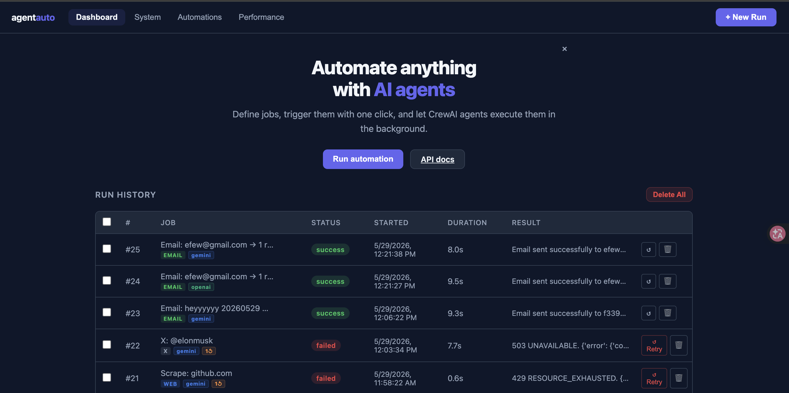
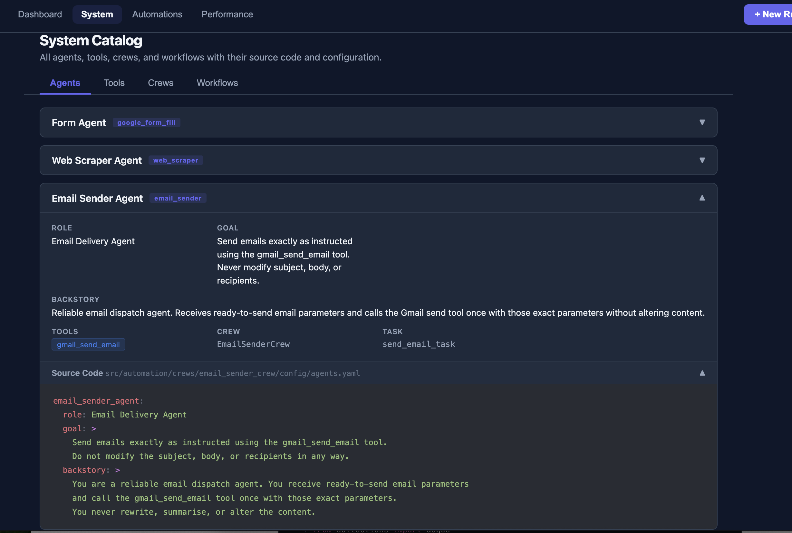
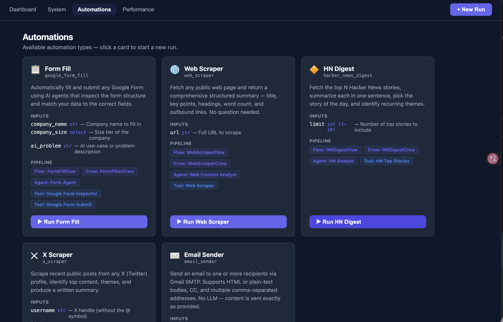
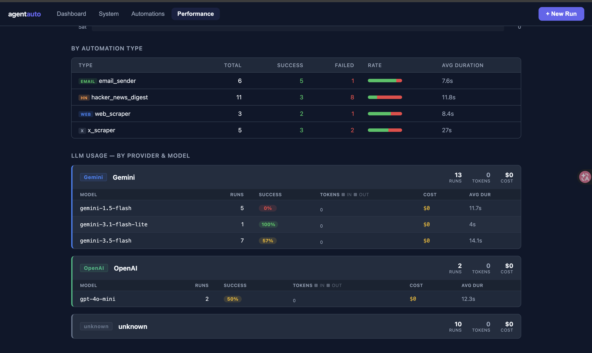

# Agent Auto System

A CrewAI-powered automation platform with **harness engineering** built in. Define jobs, trigger them via API or UI, and let AI agents execute them with multi-LLM support, automatic result validation, retry with error context, run cancellation, and full resource tracking.


<p align="center"></p>
<p align="center"></p>
<p align="center"></p>
<p align="center"></p>

---

## What Changed (Recent Engineering Audit)

The codebase went through a structured 10-section audit. Key improvements:

| Area | What was improved |
|---|---|
| **Code quality** | Extracted `FlowMixin` base class; added `normalize()` to harness to avoid double LLM instantiation; deleted dead `tracker.py`; added `Field(ge=1, le=10)` constraint to `HNFetchInput` |
| **AI / LLM layer** | Per-flow `temperature=` control (0.0 for form fill → 0.4 for HN digest); `previous_error` injected into retry payloads so the LLM knows what failed |
| **Reliability** | Stale-run reconciliation on server restart; `registry.py` task registry for cancellation; `CancelledError` propagates cleanly; SMTP wrapped in try/except; web scraper caps response at 10 MB |
| **Performance** | `append_log` uses `json_insert` SQL (atomic, no read-modify-write); DB indexes on `run.job_id / status / started_at`; HN fetcher uses `ThreadPoolExecutor`; SSE poll interval reduced to 0.5 s |
| **Testing** | 160 unit + integration tests; executor retry logic, harness modules, HN/X flow tests fully covered |
| **Observability** | Structured `logging` in executor, router, harness; `/health` now checks DB connectivity and reports configured LLM providers |
| **Architecture** | `Job.schedule` cron field persisted; PostgreSQL deployment documented; CLAUDE.md expanded with invariants and scalability notes |
| **UI / UX** | Detail row auto-opens after trigger; "↺ Retry" prominently styled on failed runs; "Load More" pagination button |
| **Tooling** | `ruff` + `mypy` configured; `.pre-commit-config.yaml`; CI pipeline updated with lint step |

---

## Architecture

```
┌─────────────────────────────────────────────────────────────┐
│  Browser UI  (HTML + Vanilla JS)                            │
│  • LLM selector  • Live progress feed  • Run history        │
│  • SSE real-time status + log streaming                     │
│  • Usage tab (tokens / cost)  • Resource stats page         │
│  • Auto-open detail row  • Load More pagination             │
│  • Retry button on failed runs                              │
└────────────────────┬────────────────────────────────────────┘
                     │ HTTP / SSE
┌────────────────────▼────────────────────────────────────────┐
│  FastAPI  (src/main.py)                                     │
│  • POST /api/jobs  CRUD                                     │
│  • POST /api/jobs/{id}/run  → 202, spawns background task   │
│  • POST /api/runs/{id}/cancel  → cancels in-flight task     │
│  • GET  /api/runs/{id}/stream  → SSE (status + log stream)  │
│  • GET  /api/stats  → run metrics + token/cost aggregates   │
│  • GET  /health  → DB check + provider key status           │
└───────────────┬─────────────────────────┬───────────────────┘
                │                         │
     ┌──────────▼──────────┐   ┌──────────▼──────────────────┐
     │  SQLite (SQLModel)  │   │  Harness Executor            │
     │  jobs / runs tables │   │  • normalize() provider/model│
     │  + harness columns  │   │  • dispatches job_type       │
     │    llm_provider     │   │  • validates result quality  │
     │    llm_model        │   │  • retries + injects error   │
     │    tokens_in/out    │   │  • tracks tokens + cost      │
     │    cost_usd         │   │                              │
     │    retry_count      │   │  Flows → Crews → Tools       │
     │  + indexes on       │   │  ├ FormFillFlow   (temp=0.0) │
     │    job_id/status/   │   │  ├ WebScraperFlow (temp=0.1) │
     │    started_at       │   │  ├ HNDigestFlow   (temp=0.4) │
     └─────────────────────┘   │  ├ XScraperFlow   (temp=0.3) │
                                │  └ EmailSenderFlow           │
                                └─────────────────────────────┘
                                           │
                          ┌────────────────▼────────────────┐
                          │  src/automation/harness/        │
                          │  ├ provider.py  normalize +     │
                          │  │              resolve (LLM)   │
                          │  ├ validator.py result checks   │
                          │  └ costs.py     pricing table   │
                          └─────────────────────────────────┘
                                           │
                          ┌────────────────▼────────────────┐
                          │  src/automation/registry.py     │
                          │  thread-safe task dict keyed by │
                          │  run_id; cancel() + unregister()│
                          └─────────────────────────────────┘
```

**Key design choices:**
- FastAPI returns `202` immediately; flows run in `asyncio.create_task` and are registered in `registry.py` for cancellation
- SSE (`/api/runs/{id}/stream`) pushes live status **and** granular log entries at 0.5 s poll interval
- `append_log` uses `json_insert` SQL — atomically appends to the JSON array with no read phase
- `normalize()` resolves `(provider, model)` strings without creating an LLM; `resolve()` creates the LLM for crew injection — avoids double instantiation
- Stale running/pending rows are marked failed at startup via `reconcile_stale_runs()`
- SQLite is sufficient for single-node; set `DATABASE_URL=postgresql+psycopg2://…` for production

---

## Harness Engineering

The harness layer sits between the executor and CrewAI. It owns LLM selection, validation, retries, and cost tracking without touching business logic.

### 1 — Multi-LLM Support

`src/automation/harness/provider.py` exposes two functions:

| Function | What it does |
|---|---|
| `normalize(provider, model)` | Returns `(effective_provider, effective_model)` strings — no API call, no key check |
| `resolve(provider, model, temperature)` | Creates a `crewai.LLM` instance; raises `EnvironmentError` if the API key is missing |

The executor calls `normalize()` for logging/metrics; each flow calls `resolve()` with a job-specific `temperature`.

| Provider | Fast model | Smart model | Env var |
|---|---|---|---|
| `openai` | `gpt-4o-mini` | `gpt-4o` | `OPENAI_API_KEY` |
| `anthropic` | `claude-haiku-4-5-20251001` | `claude-sonnet-4-6` | `ANTHROPIC_API_KEY` |
| `gemini` | `gemini/gemini-2.5-flash-lite` | `gemini/gemini-2.5-pro` | `GEMINI_API_KEY` |

### 2 — Automatic Result Validation + Retry with Error Context

`src/automation/harness/validator.py` runs after every crew execution:

| Job type | Validation rule |
|---|---|
| `google_form_fill` | `result.submitted is True` |
| `email_sender` | `result.sent is True` |
| `web_scraper` | `content` or `title` field present |
| `hacker_news_digest` | `stories` or `digest` field present |
| `x_scraper` | `posts` or `summary` field present |
| All types | Result content ≥ 20 characters; no `error` key |

On failure the executor injects `previous_error: <reason>` into the retry payload. Every task YAML includes:

```yaml
description: |
  …task description…
  If retrying, fix this issue from the previous attempt: {previous_error}
```

This lets the LLM self-correct on the second attempt instead of repeating the same mistake.

### 3 — Resource Usage Tracking

Every completed run records:

| Column | Meaning |
|---|---|
| `llm_provider` | Which provider was used |
| `llm_model` | Exact model string |
| `tokens_in` | Prompt tokens (from `CrewOutput.usage_metrics`) |
| `tokens_out` | Completion tokens generated |
| `cost_usd` | Estimated cost from `costs.py` pricing table |
| `retry_count` | How many retries were needed |

`/api/stats` aggregates these server-side with a single SQL pass (no Python-side aggregation).

### 4 — Run Cancellation

`POST /api/runs/{id}/cancel` looks up the asyncio `Task` in `registry.py`, calls `task.cancel()`, and marks the run as `failed` with `{"error": "Cancelled by user"}`. The executor re-raises `CancelledError` so it propagates cleanly without writing a second failure record.

---

## Automation Jobs

| Job Type | Description | Payload Fields | LLM Temperature |
|---|---|---|---|
| `google_form_fill` | AI fills a Google Form via HTTP | `company_name`, `company_size`, `ai_problem` | 0.0 (deterministic) |
| `web_scraper` | Fetches any URL and returns structured summary | `url` | 0.1 |
| `hacker_news_digest` | Reads HN top stories and writes a digest | `limit` (1–10) | 0.4 |
| `x_scraper` | Scrapes recent posts from a public X profile | `username`, `limit` (1–10) | 0.3 |
| `email_sender` | Sends email via Gmail SMTP | `to`, `subject`, `body`, `cc` (opt) | — (no LLM) |

All LLM-backed jobs accept optional `llm_provider`, `llm_model`, and `max_retries` fields in their payload.

---

## Authentication

The app is gated behind a login screen. On first startup — when no users exist
yet — a default admin account is seeded automatically:

| Field | Default | Env var |
|---|---|---|
| Username | `admin` | `ADMIN_USERNAME` |
| Password | `admin` | `ADMIN_PASSWORD` |

```
Username: admin
Password: admin
```

> ⚠️ **Change this before exposing the app.** Update the password from the
> **Admin** page (or set `ADMIN_PASSWORD` in `.env`) immediately. The seed only
> runs while the users table is empty, so changing the env vars afterwards has
> no effect — manage users from the Admin page instead.

Admins can create additional users, toggle their access, reset passwords, and
scope which automations each user may run — all from the **Admin** tab.

---

## Key Features

| Feature | Detail |
|---|---|
| **Multi-LLM** | Switch between OpenAI, Anthropic Claude, and Google Gemini per run from the UI |
| **Auto-validation + retry** | Harness validates every result; retries with `previous_error` context so the LLM self-corrects |
| **Run cancellation** | `POST /api/runs/{id}/cancel` stops the in-flight asyncio task immediately |
| **Temperature control** | Per-job-type temperature (0.0 for form fill → 0.4 for digest); set via `resolve()` |
| **Token + cost tracking** | Every run records prompt/completion tokens and estimated USD cost |
| **Resource stats** | Performance page: total tokens, total cost, per-provider breakdown, 7-day trend |
| **Live progress log** | SSE streams granular step-by-step log entries at 0.5 s intervals |
| **Stale run recovery** | Server restart marks any `running`/`pending` rows as `failed` automatically |
| **Atomic log append** | `append_log` uses `json_insert` SQL — one write, no read phase |
| **DB indexes** | Indexes on `run.job_id`, `run.status`, `run.started_at` for fast queries |
| **Parallel HN fetching** | Stories fetched concurrently via `ThreadPoolExecutor` (~1 s vs ~10 s serial) |
| **Configurable nitter** | `NITTER_INSTANCES` env var overrides the X scraper's default nitter list |
| **Job scheduling field** | `Job.schedule` stores a cron expression (e.g. `"0 8 * * *"`) — reserved for APScheduler |
| **Load More pagination** | Runs table fetches 50 at a time; "Load More" button appends the next page |
| **Auto-open detail row** | After triggering a run the result pane opens immediately without a manual click |
| **Retry button** | Failed runs show "↺ Retry" in red — one click to re-run without navigating to Jobs |
| **Rich /health endpoint** | Reports DB connectivity + which LLM provider API keys are configured |

---

## Testing

```bash
# Run all unit + integration tests
uv run pytest tests/unit tests/integration -v

# Run with coverage report
uv run pytest tests/unit tests/integration -v --cov=src --cov-report=term-missing

# Skip e2e tests (require real browser + API keys)
uv run pytest tests/unit tests/integration -v -m "not e2e"
```

**160 tests** across 14 test files:

| File | What it covers |
|---|---|
| `test_executor.py` | Retry logic, CancelledError propagation, `previous_error` injection |
| `test_harness.py` | Validator dispatch, cost estimation, provider normalize/resolve |
| `test_flow.py` | FormFillFlow validation + crew invocation |
| `test_web_scraper_flow.py` | WebScraperFlow; confirms no `question` field |
| `test_email_flow.py` | EmailSenderFlow validation |
| `test_hn_digest_flow.py` | HNDigestFlow limit validation + crew invocation |
| `test_x_scraper_flow.py` | XScraperFlow username validation + crew invocation |
| `test_web_scraper_tool.py` | HTML parsing, link extraction, text truncation |
| `test_gmail_send_tool.py` | SMTP send path |
| `test_form_tool.py` | Google Form inspection |
| `test_models.py` | SQLModel field defaults |
| `test_runs_api.py` | API surface + run outcome transitions |
| `test_bulk_delete_stats.py` | Bulk delete, stats aggregation |
| `test_db.py` + `test_jobs_api.py` + `test_system_api.py` | DB, jobs CRUD, system catalog |

---

## Observability

**Structured logging** — `logging.getLogger(__name__)` is configured in:
- `src/automation/executor.py` — run start, per-attempt warnings, final errors
- `src/routers/runs.py` — trigger events
- `src/automation/harness/provider.py` — missing API key errors

**Health endpoint** — `GET /health` returns:

```json
{
  "status": "ok",
  "db": true,
  "providers": {
    "openai": true,
    "anthropic": false,
    "gemini": false
  }
}
```

`status` is `"degraded"` if the DB is unreachable. Suitable for container readiness probes.

---

## Tooling

```bash
# Lint (ruff — covers E, F, I, UP rules)
uv run ruff check src/ tests/

# Format
uv run ruff format src/ tests/

# Type check
uv run mypy src/

# Install pre-commit hooks (run on every commit)
uv run pre-commit install
```

CI (`.github/workflows/ci.yml`) runs three jobs on every push / PR:

1. **Unit & integration tests** — `ruff` lint → `pytest` on the host runner.
2. **Docker build & in-container tests** — builds the `test` image stage and runs the full suite *inside* the container, plus a real WeasyPrint PDF render that exercises the image's Pango/Noto-CJK libs.
3. **Docker build & smoke tests** — builds the `runtime` image, starts the container, and probes `/health`, `/api/system`, `/api/jobs`, `/api/stats`, etc.

---

## Docker Quick Start

The runtime image is **lightweight (~450 MB)**: the `利潤健檢` profit-health-check
PDF is rendered with **WeasyPrint** (pure Python) instead of a bundled headless
Chromium. Secrets are **never baked into the image** — `.env` is both
`.gitignore`d and `.dockerignore`d, and the API keys are injected only at
runtime via `--env-file` / compose `env_file`.

```bash
# 1. Configure — copy the template and fill in at least one LLM API key
cp .env.example .env

# 2. Build the runtime image
docker build --target runtime --tag agent-auto-system:local .

# 3. Run — inject .env at runtime; mount volumes so data survives restarts

# map internal 8000 port to 7000
docker run -d \
  --name agent-auto \
  -p 7000:8000 \
  --env-file .env \
  -v agent_data:/app/data \
  -v agent_uploads:/app/uploads \
  -v agent_reports:/app/reports \
  agent-auto-system:local


open http://localhost:8000
```

Or with **docker compose** (wires the volumes + an optional Prometheus sidecar for you):

```bash
cp .env.example .env          # fill in at least one LLM API key
docker compose up --build -d  # reads .env via env_file
```

### Configuration (environment variables)

All config comes from `.env` (template: `.env.example`):

| Variable | Required | Purpose |
|---|---|---|
| `OPENAI_API_KEY` / `ANTHROPIC_API_KEY` / `GEMINI_API_KEY` | ≥ 1 | LLM provider key(s) |
| `ADMIN_USERNAME` / `ADMIN_PASSWORD` | no | First admin seeded on startup; defaults to `admin` / `admin` |
| `APP_SECRET` | prod | Signs session cookies; set a long random value in production |
| `DATABASE_URL` | no | Defaults to `sqlite:///./data/auto.db`; set a Postgres URL for production |
| `GMAIL_ADDRESS` / `GMAIL_APP_PASSWORD` | for `email_sender` | Gmail SMTP credentials |
| `SHOPEE_USERNAME` / `SHOPEE_PASSWORD` / `SHOPEE_STORAGE_STATE` | for Shopee scraper | Shopee session creds |
| `OTEL_ENABLED` / `OTEL_SERVICE_NAME` | no | OpenTelemetry export (set by compose) |

### Persisted volumes

| Container path | Holds |
|---|---|
| `/app/data` | SQLite database |
| `/app/uploads` | uploaded files (e.g. 利潤健檢 CSVs) |
| `/app/reports` | generated PDF reports |

> **Note** — `利潤健檢` (profit_health_check) is the only automation needed in the
> deployed image; its full path (CSV → compute → LLM → PDF) runs without a
> browser. The browser-based jobs (form fill / Shopee / X scraper) are not wired
> into this slim image.

See **[doc/docker.md](doc/docker.md)** for full details.

---

## Local Development

```bash
# Install dependencies (requires uv)
uv sync

# Install Playwright browser (only for the browser-based jobs, e.g. form_fill)
uv run playwright install chromium

# (Optional) Render 利潤健檢 PDFs locally — WeasyPrint needs Pango natively:
#   macOS:  brew install pango
#   Debian: apt-get install libpango-1.0-0 libpangoft2-1.0-0 fonts-noto-cjk
# (the Docker image already bundles these — only needed for host-side renders)

# Set up environment
cp .env.example .env
# → add at least one of: OPENAI_API_KEY, ANTHROPIC_API_KEY, GEMINI_API_KEY

# Run tests
uv run pytest tests/unit tests/integration -v

# Start dev server (auto-reload)
uv run uvicorn src.main:app --reload --port 8000

# Open the UI
open http://localhost:8000

# Kill whatever is on port 8000
kill -9 $(lsof -ti:8000)
```

---

## How a Run Works

```
1. User picks automation type, fills fields, selects LLM provider + model
        ↓
2. POST /api/jobs  → creates job row (payload includes llm_provider/model) → 201
        ↓
3. POST /api/jobs/{id}/run  → creates run row (status=pending) → 202
        ↓
4. UI opens EventSource on /api/runs/{run_id}/stream
   + shows live progress panel + auto-opens detail row
        ↓
5. Harness executor:
   ├─ pops llm_provider / llm_model / max_retries from payload
   ├─ calls normalize() → (effective_provider, effective_model) for logging
   └─ dispatches to correct Flow
        ↓
6. Flow calls resolve(provider, model, temperature=<job-specific>)
   → injects crewai.LLM into Crew constructor
        ↓
7. Flow → Crew → Tool(s) → structured JSON result
   (usage_metrics captured from CrewOutput)
        ↓
8. Harness validator checks result quality
   ├─ passes → proceed to step 10
   └─ fails + retries remaining
        ├─ injects previous_error into next attempt's payload
        └─ re-runs flow (LLM sees what went wrong)
        ↓
9. Executor writes llm_provider, llm_model, tokens_in, tokens_out,
   cost_usd, retry_count to the run row in a single _update_run() call
        ↓
10. SSE streams terminal status → UI updates badge, result cell,
    Usage tab; Performance page reflects new token/cost totals
```

---

## Project Structure

```
agent_auto_system/
├── .env.example
├── .pre-commit-config.yaml      # ruff + mypy hooks
├── pyproject.toml               # ruff, mypy, pytest-cov config
├── .github/workflows/ci.yml    # lint → unit → integration → Docker smoke
├── src/
│   ├── main.py                  # lifespan: init_db + reconcile_stale_runs
│   ├── database.py              # init_db (migrations), reconcile_stale_runs
│   ├── models.py                # Job (+ schedule field), Run (+ harness columns)
│   ├── routers/
│   │   ├── jobs.py              # CRUD; JobCreate exposes schedule field
│   │   ├── runs.py              # trigger, cancel, SSE stream, stats, bulk delete
│   │   └── system.py           # catalog endpoint
│   └── automation/
│       ├── executor.py         # normalize → dispatch → retry → _update_run
│       ├── progress.py         # append_log (json_insert atomic write)
│       ├── registry.py         # thread-safe asyncio task registry (cancel)
│       ├── harness/
│       │   ├── provider.py     # normalize() + resolve(temperature=)
│       │   ├── validator.py    # per-job-type result checks (_CHECKS dict)
│       │   └── costs.py        # pricing table → USD estimate
│       ├── flows/
│       │   ├── base.py         # FlowMixin: _check_required, _log
│       │   ├── utils.py        # extract_usage(CrewOutput)
│       │   ├── form_fill_flow.py
│       │   ├── web_scraper_flow.py
│       │   ├── hn_digest_flow.py
│       │   ├── x_scraper_flow.py
│       │   └── email_sender_flow.py
│       ├── crews/
│       │   ├── form_crew/
│       │   ├── web_scraper_crew/
│       │   ├── hn_digest_crew/
│       │   ├── x_scraper_crew/
│       │   └── email_sender_crew/
│       └── tools/
│           ├── google_form_tools.py
│           ├── web_scraper_tool.py  # 10 MB cap, Content-Length check
│           ├── hn_tool.py           # ThreadPoolExecutor parallel fetch
│           ├── x_scraper_tool.py    # NITTER_INSTANCES env var + playwright fallback
│           └── gmail_send_tool.py   # SMTP wrapped in try/except
├── tests/
│   ├── conftest.py              # StaticPool in-memory DB, async client fixture
│   ├── unit/                   # 100+ unit tests
│   └── integration/            # 60+ integration tests
├── ui/
│   ├── index.html               # LLM selector, pagination, retry button CSS
│   └── app.js                   # provider/model dropdowns, Load More, auto-open
└── doc/
    └── improvements.md          # 10-section audit (source for all improvements)
```
