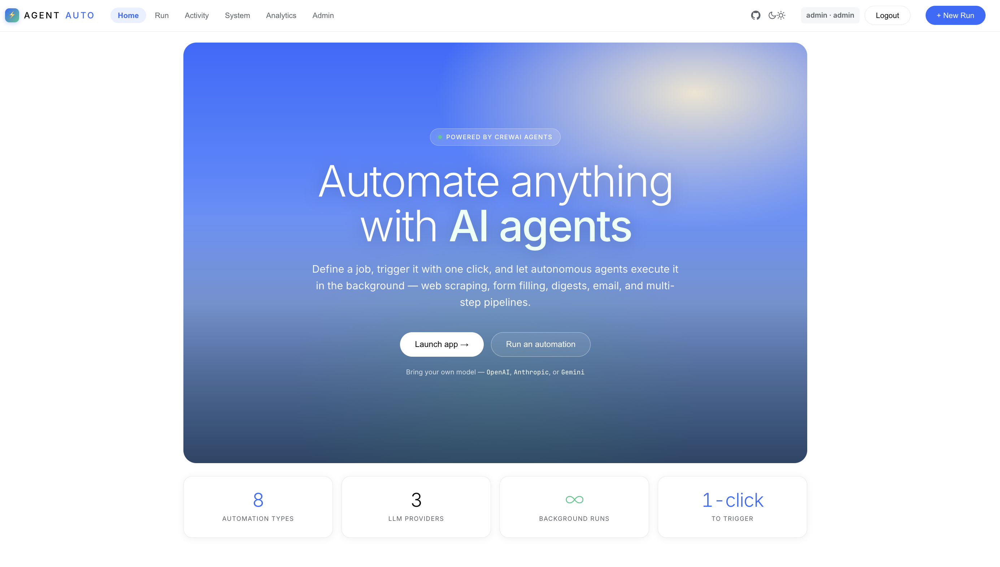
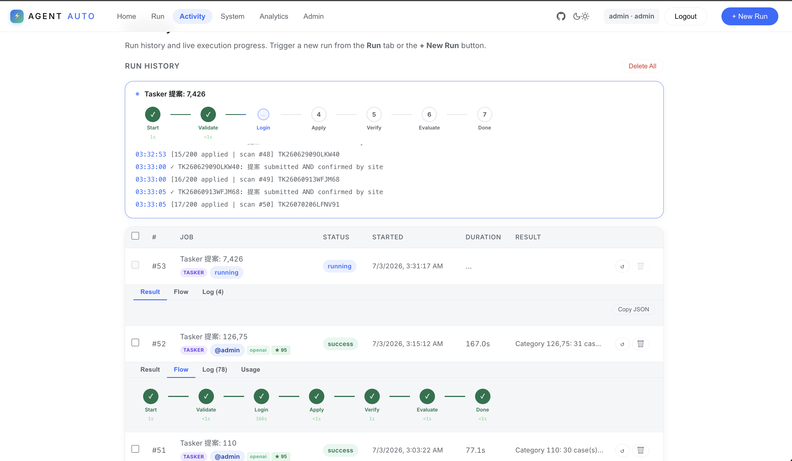
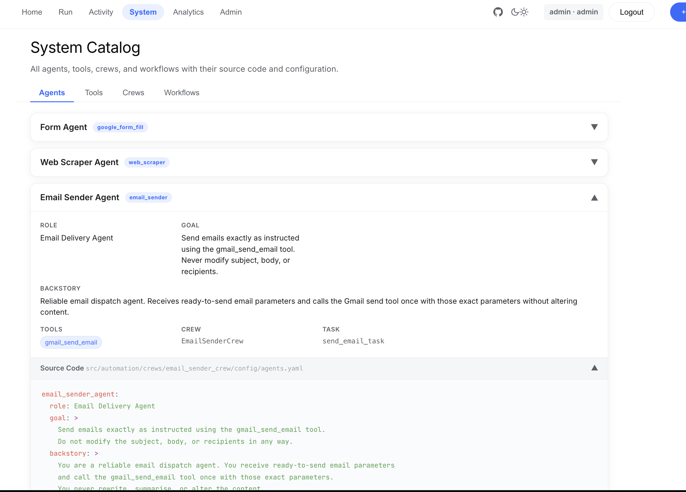
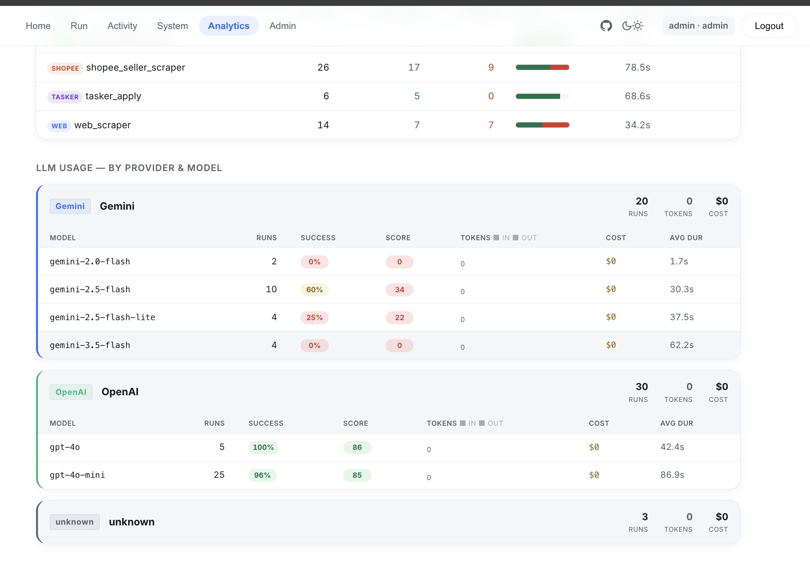
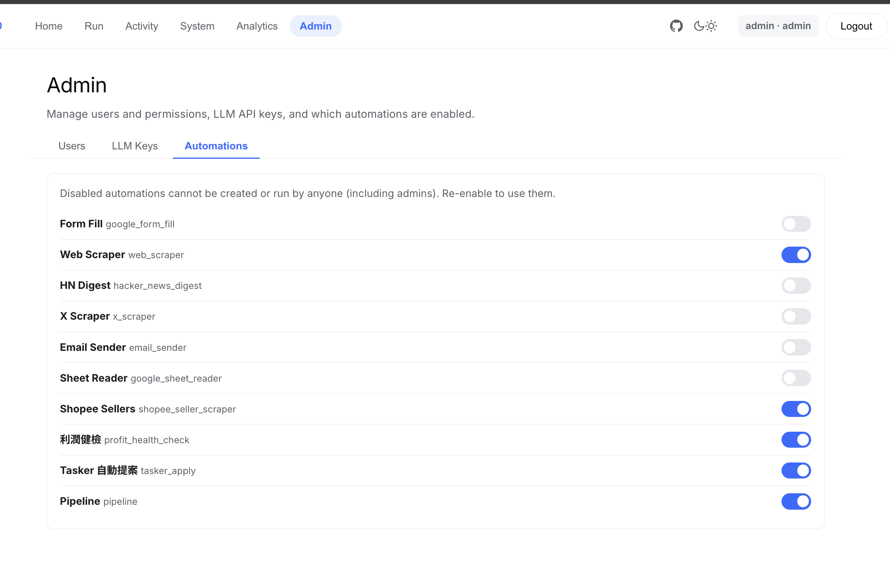

# Agent Auto System

A CrewAI-powered automation platform with **harness engineering** built in. Define jobs, trigger them via API or UI, and let AI agents execute them in the background — with multi-LLM support, automatic result validation, LLM-as-judge quality scoring, retry with error context, cross-model fallback, run cancellation, full token/cost tracking, and optional Langfuse observability. Everything sits behind a login with per-user automation permissions.

<p align="center"></p>
<p align="center"></p>
<p align="center"></p>
<p align="center"></p>
<p align="center"></p>

---

## Highlights

- **11 automation types** — from Google Form fill and web scraping to a full SMB email-collection funnel and multi-step pipelines (see [Automation Jobs](#automation-jobs)).
- **Harness layer** between the executor and CrewAI owns LLM selection, validation, LLM-as-judge evaluation, retries/fallback, and cost tracking — business logic never touches it.
- **Multi-LLM, per-run** — OpenAI, Anthropic Claude, or Google Gemini, chosen from the UI; each flow runs at a job-specific temperature.
- **Self-correcting retries** — a validator checks every result and re-runs failed jobs with the previous error injected so the LLM fixes its mistake; transient provider outages fall back across models in the same provider.
- **Quality scoring** — an independent LLM judge scores every result 0–100 (with a deterministic heuristic fallback); scores stream to the UI and Langfuse.
- **Observability** — live SSE progress log, token/cost stats, a rich `/health`, and optional per-run Langfuse traces.
- **380 tests**, `ruff` + `mypy`, CI with Docker build + smoke tests, and a slim (~450 MB) runtime image.

---

## Architecture

```
┌──────────────────────────────────────────────────────────────────┐
│  Browser UI  (HTML + Vanilla JS, login-gated)                     │
│  • Automation picker + per-job form   • LLM provider/model select │
│  • Live SSE progress + step graph     • Run history + detail pane  │
│  • Usage (tokens/cost) + eval score   • Analytics / stats page     │
│  • Admin page (users, keys, toggles)  • CSV / PDF result exports   │
└───────────────────────────┬──────────────────────────────────────┘
                            │ HTTP / SSE (cookie auth)
┌───────────────────────────▼──────────────────────────────────────┐
│  FastAPI  (src/main.py — lifespan: init_db + reconcile_stale_runs)│
│  routers/  auth · admin · jobs · runs · system · uploads          │
│  • POST /api/jobs                       CRUD (payload = JSON)      │
│  • POST /api/jobs/{id}/run  → 202, asyncio.create_task            │
│  • POST /api/runs/{id}/cancel           cancel in-flight task      │
│  • GET  /api/runs/{id}/stream           SSE status + log stream    │
│  • GET  /api/runs/{id}/report.pdf       profit-health PDF          │
│  • GET  /api/runs/{id}/leads.csv        email-collect export       │
│  • POST /api/uploads                    multipart file intake      │
│  • GET  /api/stats  ·  /api/system  ·  /health                     │
└───────────────┬───────────────────────────────┬──────────────────┘
                │                                 │
     ┌──────────▼───────────┐        ┌───────────▼─────────────────┐
     │  SQLite / Postgres   │        │  Harness Executor            │
     │  (SQLModel)          │        │  • normalize() provider/model│
     │  users · settings    │        │  • dispatch job_type → Flow  │
     │  jobs · runs         │        │  • validate result           │
     │  + harness columns   │        │  • retry + inject error      │
     │    llm_provider/model│        │  • cross-model fallback      │
     │    tokens_in/out     │        │  • LLM-as-judge evaluate     │
     │    cost_usd          │        │  • token + cost accounting   │
     │    retry_count       │        │  • Langfuse trace (optional) │
     │    eval_score/…      │        └───────────┬─────────────────┘
     │  + indexes           │                    │
     └──────────────────────┘        ┌───────────▼─────────────────┐
                                      │  Flows → Crews → Tools       │
                                      │  (per-flow temperature)      │
                                      │  form_fill · web_scraper ·   │
                                      │  hn_digest · x_scraper ·     │
                                      │  email_sender · sheet_reader │
                                      │  shopee · profit_health ·    │
                                      │  tasker_apply · email_collect│
                                      │  + pipeline (chains steps)   │
                                      └───────────┬─────────────────┘
                                                  │
                         ┌────────────────────────▼────────────────┐
                         │  src/automation/harness/                 │
                         │  provider.py  normalize/resolve+fallback │
                         │  validator.py per-job result checks      │
                         │  evaluator.py independent LLM-as-judge    │
                         │  costs.py     pricing → USD estimate      │
                         │  langfuse_tracer.py  per-run trace        │
                         └──────────────────────────────────────────┘
                         registry.py — thread-safe task dict for cancel()
```

**Key design choices**
- FastAPI returns `202` immediately; flows run in `asyncio.create_task`, registered in `registry.py` for cancellation.
- SSE (`/api/runs/{id}/stream`) pushes live status **and** granular log entries by polling the DB every 0.5 s until terminal.
- `append_log` uses `json_insert` SQL — atomically appends to the JSON log array with no read-modify-write.
- `normalize()` resolves `(provider, model)` strings without creating an LLM; `resolve()` builds the `crewai.LLM` for crew injection — avoids double instantiation.
- Crews are **plain classes, not `@CrewBase`** — the decorator's `id(self)` memoize cache serves stale LLMs after GC reuses addresses. Each crew rebuilds its Agent/Task/Crew fresh per run.
- Stale `running`/`pending` rows are marked `failed` at startup via `reconcile_stale_runs()`.
- SQLite for single-node; set `DATABASE_URL=postgresql+psycopg2://…` for production.

---

## Automation Jobs

| Job Type | What it does | Payload | Temp | Tools |
|---|---|---|---|---|
| `google_form_fill` | AI inspects a Google Form and submits it via HTTP | `company_name`, `company_size`, `ai_problem` | 0.0 | Form inspector + submit |
| `web_scraper` | Fetches a URL → structured summary (title, points, links) | `url` | 0.1 | Web scraper (10 MB cap) |
| `google_sheet_reader` | Reads a public Google Sheet → columns, stats, insights | `url`, `limit` (1–500) | 0.1 | Sheet reader (CSV export) |
| `shopee_seller_scraper` | Collects sellers behind top Shopee products | `keyword`, `limit` (1–100) | 0.2 | Playwright + Shopee API |
| `profit_health_check` (利潤健檢) | 4-agent crew: validate → correct → analyze → advise on uploaded Shopee CSVs; emits a PDF | `upload_id` (files) | 0.2 | Profit calc + PDF render |
| `x_scraper` | Scrapes recent posts from a public X profile | `username`, `limit` (1–10) | 0.3 | Nitter + Playwright fallback |
| `hacker_news_digest` | Reads HN top stories → digest + themes | `limit` (1–10) | 0.4 | HN API (parallel fetch) |
| `email_collect` (Email Collector) | Google Maps funnel: discover businesses → scrape emails → verify → dedupe → AI qualifies + writes a hook | `query`, `region`, `industry`, `offer`, `limit` (1–40), `smtp_check` | 0.4 | Maps search + email extract + verify |
| `tasker_apply` | Logs into tasker.com.tw and auto-applies (提案) to open cases with an AI-written proposal | `category_ids`, `min_charge`, `max_charge`, `max_cases`, `dry_run` | 0.5 | Playwright + proposal crew |
| `email_sender` | Sends email via Gmail SMTP | `to`, `subject`, `body`, `cc?` | — | Gmail SMTP (no LLM) |
| `pipeline` | Chains any of the above in sequence; each step's output is available to later steps via `{{steps.N.result}}` | `steps[]` | per-step | per-step |

All LLM-backed jobs accept optional `llm_provider`, `llm_model`, and `max_retries` in their payload. File-upload jobs (e.g. `profit_health_check`) POST files to `/api/uploads` first, then submit a small `{upload_id}` payload so the run stays JSON-only and re-runnable.

### Adding a new job type

Touch these 6 files (see `CLAUDE.md`): `executor.py` (`_FLOW_MAP`) · `flows/<name>_flow.py` · `crews/<name>_crew/` · `routers/system.py` (`_CATALOG`) · `ui/app.js` (+ `ui/index.html`) · `settings_store.py` (`ALL_AUTOMATIONS` — required, or the type is invisible in the UI and blocked server-side).

---

## Harness Engineering

The harness (`src/automation/harness/`) sits between the executor and CrewAI. It owns LLM selection, validation, evaluation, retries, and cost tracking without touching business logic.

### 1 — Multi-LLM support

`provider.py` exposes:

| Function | What it does |
|---|---|
| `normalize(provider, model)` | Returns effective `(provider, model)` strings — no API call, no key check (used for logging/metrics) |
| `resolve(provider, model, temperature)` | Builds a `crewai.LLM`; raises if the API key is missing |
| `fallback_sequence(provider, model)` | Ordered model list for cross-model retry within a provider |

| Provider | Default (fast) | Also available | Env var |
|---|---|---|---|
| `openai` | `gpt-4o-mini` | `gpt-4o` | `OPENAI_API_KEY` |
| `anthropic` | `claude-haiku-4-5-20251001` | `claude-sonnet-4-6` | `ANTHROPIC_API_KEY` |
| `gemini` | `gemini/gemini-2.5-flash` | `gemini-3.5-flash`, `gemini-3.1-flash-lite`, `gemini-2.5-pro`, `gemini-2.5-flash-lite` | `GEMINI_API_KEY` |

### 2 — Validation + retry with error context

`validator.py` runs after every crew execution. Each job type has a rule; all types also require ≥ 20 chars of content and no `error` key:

| Job type | Rule |
|---|---|
| `google_form_fill` | `submitted is True` |
| `email_sender` | `sent is True` |
| `web_scraper` | `content` / `title` / `summary` present |
| `google_sheet_reader` | `columns` / `data` / `summary` present |
| `hacker_news_digest` | `stories` / `digest` / `items` present |
| `x_scraper` | `posts` / `profile` / `summary` present |
| `shopee_seller_scraper` | non-empty `sellers` |
| `profit_health_check` | `skus` / `action_items` / `recommendations` present |
| `tasker_apply` | `applied[]` list + `cases_found` set |
| `email_collect` | `discovered_count > 0` |
| `pipeline` | steps completed |

On failure the executor injects `previous_error: <reason>` into the retry payload; every task YAML ends with `If retrying, fix this issue from the previous attempt: {previous_error}` so the LLM self-corrects.

### 3 — Cross-model fallback (transient outages)

Separate from job-level `max_retries`, the executor retries the *kickoff* itself up to `MAX_LLM_ATTEMPTS` (5): the requested model is tried twice, then it advances through `fallback_sequence()` (other models in the same provider) with exponential backoff. Only transient errors (`503`, `429`, `overloaded`, timeouts…) trigger this; hard errors (bad key, 400) raise immediately.

### 4 — LLM-as-judge evaluation

`evaluator.py` scores every result 0–100 with a confidence (0–1), purely informational (never flips success/failed). The judge is an **independent** model — never the one that produced the output (self-grading inflates scores) — chosen by: admin setting → `EVAL_JUDGE_*` env → default (`gemini-2.5-flash`), falling back to a sibling model, then a heuristic if no LLM is available. Per-job rubrics ground the score in each job's contract.

### 5 — Resource tracking & observability

Every run records `llm_provider`, `llm_model`, `tokens_in`, `tokens_out`, `cost_usd` (from `costs.py`), `retry_count`, and `eval_score`/`eval_confidence`/`eval_notes`/`eval_method`. `/api/stats` aggregates server-side in a single SQL pass. When `LANGFUSE_PUBLIC_KEY` / `LANGFUSE_SECRET_KEY` are set, `langfuse_tracer.py` emits one trace per run (model, tokens, cost, eval, status) — a no-op otherwise, and it never raises.

### 6 — Run cancellation

`POST /api/runs/{id}/cancel` looks up the asyncio `Task` in `registry.py`, calls `task.cancel()`, and marks the run `failed`. The executor re-raises `CancelledError` so it propagates without writing a second failure record.

---

## Authentication & Admin

The app is login-gated. On first startup (empty users table) a default admin is seeded:

| Field | Default | Env var |
|---|---|---|
| Username | `admin` | `ADMIN_USERNAME` |
| Password | `admin` | `ADMIN_PASSWORD` |

> ⚠️ **Change this before exposing the app.** The seed only runs while the users table is empty; afterwards manage users from the **Admin** page.

From the **Admin** tab admins can: create/toggle/reset users, scope which automations each user may run (`allowed_automations`), globally enable/disable automation types (`enabled_automations`), store **Fernet-encrypted** LLM API keys in the DB, and pick the eval judge model. Automation visibility (UI) and run permission (server) both derive from these settings.

---

## Key Features

| Feature | Detail |
|---|---|
| **11 automation types** | Form fill, web/sheet/X/Shopee scraping, HN digest, email send, profit-health (PDF), tasker auto-apply, email collector, pipelines |
| **Multi-LLM per run** | OpenAI, Anthropic, Gemini — selected from the UI; per-job temperature |
| **Auto-validation + retry** | Result checks with `previous_error` re-injection for self-correction |
| **Cross-model fallback** | Transient provider outages fall back across sibling models (5 attempts) |
| **LLM-as-judge scoring** | Independent judge scores 0–100; heuristic fallback; configurable judge |
| **Run cancellation** | Cancels the in-flight asyncio task immediately |
| **Token + cost tracking** | Per-run tokens + estimated USD; stats page with per-provider + 7-day trend |
| **Live progress + step graph** | SSE streams granular log entries every 0.5 s |
| **Pipelines** | Chain automations; pass outputs via `{{steps.N.result}}` templates |
| **File uploads** | Multipart intake under `uploads/<uuid>/`; JSON-only re-runnable payloads |
| **Result exports** | Profit-health PDF (`/report.pdf`) + email-collect CSV (`/leads.csv`, UTF-8 BOM) |
| **Langfuse tracing** | Optional per-run traces when keys are configured |
| **Auth + RBAC** | Login gate, seeded admin, per-user automation allowlists, encrypted API keys |
| **Stale run recovery** | Restart marks orphaned `running`/`pending` runs as `failed` |
| **Rich /health** | DB connectivity + which provider keys are configured |

---

## How a Run Works

```
1. User picks automation, fills fields, selects LLM provider + model
        ↓
2. POST /api/jobs         → job row (payload incl. llm_provider/model)  → 201
3. POST /api/jobs/{id}/run → run row (status=pending), asyncio task     → 202
        ↓
4. UI opens EventSource on /api/runs/{id}/stream, auto-opens detail row
        ↓
5. Executor: pop llm_provider/model/max_retries → normalize() → dispatch Flow
        ↓
6. Flow calls resolve(provider, model, temperature=<job-specific>)
   → injects crewai.LLM into the Crew (fresh Agent/Task/Crew, no @CrewBase)
        ↓
7. Flow → Crew → Tool(s) → structured JSON  (usage_metrics captured)
   • transient model outage → cross-model fallback (up to 5 attempts)
        ↓
8. Validator checks the result
   ├ pass → continue
   └ fail + retries left → inject previous_error, re-run flow
        ↓
9. Evaluator (independent LLM judge) scores quality 0–100
        ↓
10. Executor writes provider/model/tokens/cost/retry/eval in one _update_run()
        ↓
11. Langfuse trace emitted (if configured); SSE streams terminal status →
    UI updates badge, result cell, Usage + eval; stats page reflects new totals
```

---

## Testing

```bash
uv run pytest tests/unit tests/integration -v                  # all
uv run pytest tests/unit tests/integration -v -m "not e2e"     # skip e2e
uv run pytest tests/unit/test_flow.py::test_name -v            # single
uv run pytest tests/unit tests/integration --cov=src --cov-report=term-missing
```

**380 tests** across 26 unit + 10 integration files, covering executor retry/fallback, harness (validator, costs, provider, evaluator, langfuse), every flow + tool, the email-collect funnel, auth/admin, uploads, and the full API surface.

---

## Docker Quick Start

The runtime image is **lightweight (~450 MB)**: the 利潤健檢 PDF is rendered with **WeasyPrint** (pure Python), not a bundled Chromium. Secrets are **never baked in** — `.env` is `.gitignore`d and `.dockerignore`d; keys are injected only at runtime.

```bash
cp .env.example .env                                   # fill in ≥ 1 LLM API key
docker build --target runtime --tag agent-auto-system:local .
docker run -d --name agent-auto -p 7000:8000 --env-file .env \
  -v agent_data:/app/data -v agent_uploads:/app/uploads -v agent_reports:/app/reports \
  agent-auto-system:local
open http://localhost:7000
```

Or with compose (wires volumes + optional Prometheus sidecar): `docker compose up --build -d`.

### Configuration (environment variables)

| Variable | Required | Purpose |
|---|---|---|
| `OPENAI_API_KEY` / `ANTHROPIC_API_KEY` / `GEMINI_API_KEY` | ≥ 1 | LLM provider key(s) — can also be stored (encrypted) via Admin |
| `ADMIN_USERNAME` / `ADMIN_PASSWORD` | no | First admin seeded on startup (`admin`/`admin`) |
| `APP_SECRET` | prod | Signs session cookies — set a long random value |
| `DATABASE_URL` | no | Defaults to `sqlite:///./data/auto.db`; set a Postgres URL for prod |
| `EVAL_JUDGE_PROVIDER` / `EVAL_JUDGE_MODEL` | no | Override the LLM-as-judge (else Admin setting → default Gemini) |
| `LANGFUSE_PUBLIC_KEY` / `LANGFUSE_SECRET_KEY` / `LANGFUSE_HOST` | no | Enable per-run Langfuse traces |
| `GMAIL_ADDRESS` / `GMAIL_APP_PASSWORD` | for `email_sender` | Gmail SMTP credentials |
| `SHOPEE_USERNAME` / `SHOPEE_PASSWORD` / `SHOPEE_STORAGE_STATE` | for Shopee | Session creds (run `scripts/shopee_login.py` once) |
| `TASKER_USERNAME` / `TASKER_PASSWORD` / `TASKER_STORAGE_STATE` | for `tasker_apply` | Session creds (run `scripts/tasker_login.py` once) |
| `NITTER_INSTANCES` | no | Overrides the X scraper's nitter list |
| `OTEL_ENABLED` / `OTEL_SERVICE_NAME` | no | OpenTelemetry export (set by compose) |

**Persisted volumes:** `/app/data` (SQLite), `/app/uploads` (uploaded CSVs), `/app/reports` (PDFs).

See **[doc/docker.md](doc/docker.md)** for full details, and **[doc/aws-ecs-fargate-deployment.md](doc/aws-ecs-fargate-deployment.md)** for cloud deployment.

---

## Local Development

```bash
uv sync                                       # install deps
uv run playwright install chromium            # for browser jobs (form/Shopee/X/tasker/email_collect)

cp .env.example .env                          # add ≥ 1 LLM API key

uv run pytest tests/unit tests/integration -v # run tests
uv run uvicorn src.main:app --reload --port 8000
open http://localhost:8000
kill -9 $(lsof -ti:8000)                       # free port 8000
```

Rendering 利潤健檢 PDFs on the host needs Pango natively (`brew install pango` / `apt-get install libpango-1.0-0 libpangoft2-1.0-0 fonts-noto-cjk`); the Docker image already bundles these.

## Tooling

```bash
uv run ruff check src/ tests/     # lint (E, F, I, UP)
uv run ruff format src/ tests/    # format
uv run mypy src/                  # type check
uv run pre-commit install         # git hooks
```

CI (`.github/workflows/ci.yml`): (1) `ruff` + `pytest` on the host, (2) Docker `test` image build + full suite in-container + a real WeasyPrint PDF render, (3) Docker `runtime` image build + `/health` / `/api/*` smoke tests.

---

## Project Structure

```
agent_auto_system/
├── src/
│   ├── main.py                  # lifespan: init_db + reconcile_stale_runs
│   ├── database.py              # engine, init_db (idempotent migrations)
│   ├── models.py                # User · Setting · Job (+schedule) · Run (+harness/eval cols)
│   ├── auth.py                  # login, RBAC (assert_can_run)
│   ├── settings_store.py        # ALL_AUTOMATIONS, enabled set, encrypted keys, eval judge
│   ├── telemetry.py             # OpenTelemetry / Prometheus metrics
│   ├── routers/                 # auth · admin · jobs · runs · system · uploads
│   └── automation/
│       ├── executor.py          # normalize → dispatch → retry/fallback → evaluate → trace
│       ├── pipeline.py          # multi-step pipeline runner ({{steps.N.result}})
│       ├── progress.py          # append_log (json_insert atomic write)
│       ├── registry.py          # thread-safe asyncio task registry (cancel)
│       ├── report_render.py     # 利潤健檢 JSON → HTML → PDF (WeasyPrint)
│       ├── harness/             # provider · validator · costs · evaluator · langfuse_tracer
│       ├── flows/               # base + utils + 10 Flow[StateModel] subclasses
│       ├── crews/               # one crew package per job (plain classes, no @CrewBase)
│       └── tools/               # form, web, sheet, hn, x, shopee, profit, tasker,
│                                #   gmail, maps_search, email_extract, email_verify
├── scripts/                     # shopee_login.py, tasker_login.py (persist sessions)
├── tests/  (unit/ + integration/, 380 tests)
├── ui/     index.html · app.js · styles.css
└── doc/    design · dev-notes · docker · auth-and-admin · profit-health · email_collect · …
```

See **[CLAUDE.md](CLAUDE.md)** for architecture invariants and **[doc/dev-notes.md](doc/dev-notes.md)** for PostgreSQL deployment, scalability roadmap, and deeper harness internals.
