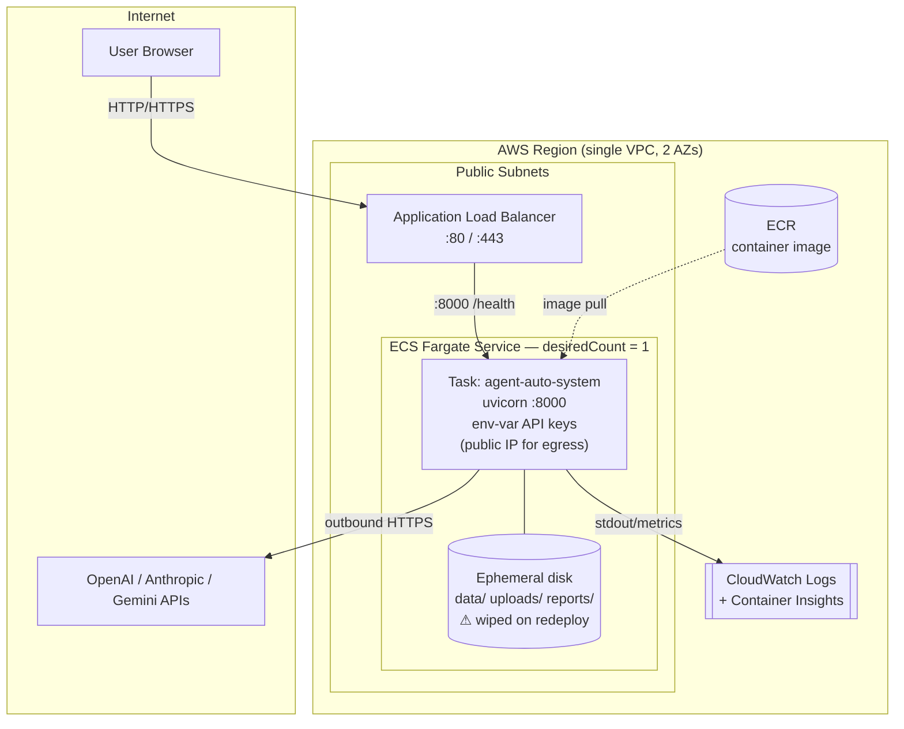

# AWS ECS Fargate Deployment Design

> Deploying **Agent Auto System** (FastAPI + CrewAI, single Docker image) to AWS
> ECS Fargate. Goal: **simple and elegant** — phase 1 keeps all generated data
> on the task's own disk, API keys as runtime env vars, no managed DB, no EFS,
> no Secrets Manager. The fewest moving parts that run the app.

---

## 1. Goals & Constraints

| Goal | Decision |
|---|---|
| Run our existing Docker image as-is | Fargate task from the `runtime` stage |
| Keep generated data "on the machine" | Task **ephemeral storage** (local disk) — no EFS |
| No managed database | Keep **SQLite** on the task's local disk |
| API keys, no extra services | Passed as **task-definition env vars** at runtime |
| Simple & cheap | No NAT Gateway, no EFS, no Secrets Manager, single task |

### ⚠️ Phase-1 trade-off: data is disposable

All generated data — the SQLite DB (job/run **history**), `uploads/`, and
`reports/` PDFs — lives on the task's **ephemeral storage**. That disk is **wiped
on every redeploy, crash, or restart**. A new image push → new task → empty disk.

This is an accepted phase-1 trade: reports are regenerable, and we don't yet need
history to survive deploys. The upgrade path (EFS / S3) is one step and needs
**zero app changes** — see §8.

### The constraint that shapes the whole design

The app is **stateful and in-process**:

- Background job runs are `asyncio.create_task()` inside the **same uvicorn
  process** (`src/automation/registry.py` holds the live task dict).
- Run cancellation and SSE streaming (`GET /api/runs/{id}/stream`) both read
  that in-process state + a **single SQLite file**.

> **Therefore the service must run exactly ONE task (`desiredCount = 1`).**
> Two tasks would mean two independent SQLite files (split-brain) and runs that
> can't be cancelled or streamed because they live in a different process.

Horizontal scaling is explicitly *out of scope* here — it requires PostgreSQL +
a real job queue (already sketched in [`dev-notes.md`](dev-notes.md)). This
design optimizes for **one always-on box, done cleanly**.

---

## 2. Architecture



### ASCII fallback

```
        Internet
           │  HTTPS
           ▼
   ┌───────────────┐         ┌───────────────────────────┐
   │  ALB (public) │────────▶│  Fargate Task              │──HTTPS──▶ LLM APIs
   │  :80 / :443   │ :8000   │  uvicorn :8000             │           (OpenAI…)
   └───────────────┘ /health │  env-var API keys          │
                             │  public IP (egress)        │
                             │  ┌──────────────────────┐  │
                             │  │ ephemeral disk        │  │
                             │  │ data/ uploads/ reports│  │
                             │  │ ⚠ wiped on redeploy   │  │
                             │  └──────────────────────┘  │
                             └────────────┬───────────────┘
                                          │ logs/metrics
                                          ▼
                                   CloudWatch Logs
```

---

## 3. Component Breakdown

### 3.1 Networking — *no NAT Gateway* (the cost-elegant choice)

- One VPC, **2 AZs**, with **public subnets only** (no private subnets, no NAT).
- The Fargate task runs in a **public subnet with a public IP**. That gives it
  outbound internet (to reach the LLM APIs) **without a ~$32/mo NAT Gateway**.
- The task's **security group** allows inbound **only from the ALB SG** on
  :8000. The public IP is for *egress*; nothing reaches the container directly.
- ALB sits in the public subnets, open to :80/:443 from the internet.

> Trade-off: a public-IP task is slightly less "textbook" than a private subnet
> behind NAT, but it's locked down by SG, costs ~$32/mo less, and is materially
> simpler. For a single-box internal tool this is the right call.

### 3.2 Compute — ECS Fargate

- **Cluster**: one ECS cluster, Fargate launch type.
- **Task definition**: `0.5 vCPU / 1 GB` to start (WeasyPrint PDF rendering is
  the heaviest op; bump to 1 vCPU / 2 GB if reports are slow). Linux/x86_64 or
  arm64 — build the image to match (arm64 is ~20% cheaper).
- **Ephemeral storage**: default 20 GB. Bump `ephemeralStorageGiB` (21–200) if
  reports/uploads grow large. This is the app's entire `data/`+`uploads/`+
  `reports/` working set.
- **Service**: `desiredCount = 1`, `minHealthyPercent = 0` /
  `maxHealthyPercent = 100`. This forces **stop-then-start** deploys (no two
  tasks ever sharing the in-process state). Brief downtime on deploy is
  acceptable for an internal tool; it's the correct behavior given the
  single-writer constraint.
- **Health check**: ALB target group hits `GET /health` (already DB-aware).

### 3.3 Storage — task ephemeral disk (no EFS)

No volumes are mounted. The app writes to its own container filesystem exactly
as it does locally — **zero code changes**:

| Container path | Purpose | Survives redeploy? |
|---|---|---|
| `/app/data` | SQLite `auto.db` (job/run history) | ❌ no |
| `/app/uploads` | user CSV/PDF uploads | ❌ no |
| `/app/reports` | generated PDF reports | ❌ no |

`DATABASE_URL` keeps the Dockerfile default (`sqlite:///./data/auto.db`), so the
DB lands on the local disk. Nothing to configure.

> **Why this is fine for phase 1:** the single-task design already means a
> restart loses in-flight runs anyway, and the app does stale-run reconciliation
> on startup. Treat all generated data as a regenerable cache. When that stops
> being acceptable, add EFS (§8) — same paths, no app change.

### 3.4 Configuration & API keys — runtime env vars (no Secrets Manager)

The app reads every credential from env vars (`os.getenv("OPENAI_API_KEY")`,
etc.). We set them directly in the **task definition's `environment` block** —
injected when the task launches, never baked into the image:

```
OPENAI_API_KEY, ANTHROPIC_API_KEY, GEMINI_API_KEY,
GMAIL_ADDRESS, GMAIL_APP_PASSWORD          # + SHOPEE_* / NITTER_* if used
```

- ❌ **Do NOT put keys in the Dockerfile** (`ENV`/`ARG`). They would be frozen
  into image layers, pushed to ECR, and recoverable via `docker history`.
- ✅ Task-def env vars keep keys **out of the image**. Code needs **zero
  changes** — same env var names either way.

> Accepted trade: task-def env vars are plaintext to anyone with IAM read on
> ECS. Acceptable for a single internal box. Free hardening later without
> Secrets Manager: **SSM Parameter Store SecureString** (see §8).

### 3.5 Image registry — ECR

- One private ECR repo: `agent-auto-system`.
- Build the **`runtime`** target, tag with git SHA + `latest`, push to ECR.
- Lifecycle policy: keep last 10 images.

### 3.6 Observability

- **CloudWatch Logs**: container stdout (uvicorn + structured app logs) → one
  log group, 30-day retention.
- **Container Insights** on the cluster for CPU/mem/task health.
- The app already exposes Prometheus metrics + OTEL. For now CloudWatch is
  enough; a sidecar scraper can come later if needed (out of scope to keep it
  simple).

---

## 4. Deploy Flow

```
 dev / CI                          AWS
 ────────                          ───
 docker build --target runtime  ┐
 docker tag  …:<sha>            ├─▶  ECR  ──┐
 docker push                    ┘           │
                                            ▼
 cdk deploy  ───────────────────▶  CloudFormation
                                     • updates task def → new image
                                     • ECS stop old task, start new
                                     • ALB health-checks /health
                                     • ⚠ ephemeral disk starts empty
```

1. `docker build --target runtime -t <ecr>/agent-auto-system:<sha> .`
2. `docker push <ecr>/agent-auto-system:<sha>`
3. `cdk deploy` (or update the service to the new tag).
4. ECS drains the old task and starts the new one. **Generated data does NOT
   carry over** — the new task boots with an empty disk.

A GitHub Actions job can do all four steps on push to `main` (the repo already
builds + tests the image in CI).

---

## 5. Cost Estimate (us-east-1, rough, always-on)

| Resource | Spec | ~Monthly |
|---|---|---|
| Fargate task | 0.5 vCPU / 1 GB, 24×7 | ~$18 |
| ALB | 1 LB + minimal LCU | ~$18 |
| ECR + CloudWatch | small | ~$1–2 |
| EFS | **not used (phase 1)** | $0 |
| Secrets Manager | **not used (phase 1)** | $0 |
| NAT Gateway | **avoided by design** | $0 |
| **Total** | | **≈ $36/mo** |

Drop the ALB and expose the task directly (or front it with CloudFront/API
Gateway) if you want it even cheaper — but the ALB gives clean TLS termination
and `/health`-based recovery, worth the ~$18.

---

## 6. CDK Implementation Plan

The existing `agent-auto-system-stack/` currently contains only boilerplate
SQS/SNS — replace it. Single stack, CDK v2 (already on `aws-cdk-lib ^2.251`).

```
agent-auto-system-stack/
  bin/agent-auto-system-stack.ts      # app entry (env: account/region)
  lib/agent-auto-system-stack.ts      # the stack below
```

**Stack composition (`lib/`):**

```ts
// 1. Network — public-only VPC, no NAT
const vpc = new ec2.Vpc(this, 'Vpc', {
  maxAzs: 2,
  natGateways: 0,
  subnetConfiguration: [{ name: 'public', subnetType: ec2.SubnetType.PUBLIC }],
});

// 2. Image — built from the repo's runtime stage and pushed to ECR by CDK
const image = ecs.ContainerImage.fromAsset('..', { target: 'runtime' });

// 3. Fargate service behind ALB — desiredCount = 1, single writer
const svc = new ecsp.ApplicationLoadBalancedFargateService(this, 'Svc', {
  vpc, cpu: 512, memoryLimitMiB: 1024, desiredCount: 1,
  ephemeralStorageGiB: 21,              // local disk for data/uploads/reports
  taskImageOptions: {
    image, containerPort: 8000,
    // API keys as plain runtime env vars (phase 1 — no Secrets Manager).
    // Prefer reading from CDK context / process.env at synth time over
    // hardcoding; never commit real keys to the repo.
    environment: {
      OPENAI_API_KEY:     process.env.OPENAI_API_KEY     ?? '',
      ANTHROPIC_API_KEY:  process.env.ANTHROPIC_API_KEY  ?? '',
      GEMINI_API_KEY:     process.env.GEMINI_API_KEY     ?? '',
      GMAIL_ADDRESS:      process.env.GMAIL_ADDRESS       ?? '',
      GMAIL_APP_PASSWORD: process.env.GMAIL_APP_PASSWORD  ?? '',
      // DATABASE_URL left at the Dockerfile default → sqlite on local disk
    },
  },
  assignPublicIp: true,                 // egress without NAT
  taskSubnets: { subnetType: ec2.SubnetType.PUBLIC },
  minHealthyPercent: 0,                 // stop-then-start: never 2 writers
  maxHealthyPercent: 100,
  publicLoadBalancer: true,
});
svc.targetGroup.configureHealthCheck({ path: '/health' });
```

That's the whole stack — no EFS volumes, no Secret constructs, no IAM for
secrets. Run `OPENAI_API_KEY=… ANTHROPIC_API_KEY=… cdk deploy` (keys come from
your shell env at synth time, not the repo).

---

## 7. Operational Notes

- **Deploys cause ~30–60s downtime** (stop-then-start) **and wipe generated
  data**. Both are accepted phase-1 behavior given the single-writer + ephemeral
  design. Don't "fix" downtime by allowing 2 tasks.
- **No backups in phase 1** — data is disposable by design. If any data becomes
  worth keeping, that's the trigger for §8 (EFS + AWS Backup).
- **TLS**: add an ACM cert + HTTPS listener on the ALB when you have a domain;
  point Route 53 at the ALB.
- **Restart safety**: the app already does stale-run reconciliation on startup,
  so a task restart cleanly fails-forward in-flight runs.

---

## 8. When to Outgrow This

This design is deliberately a single, stateless-on-disk box. Migrate the moment
a phase-1 trade stops being acceptable — each step is additive, no rewrite:

| Signal | Migration |
|---|---|
| Reports / history must survive redeploys | Add **EFS**, mount at `/app/data` + `/app/uploads` + `/app/reports`, set `DATABASE_URL=sqlite:////app/data/auto.db`. **No app code change.** |
| Keys shouldn't be plaintext in the task def | Move to **SSM Parameter Store SecureString** (free) or **Secrets Manager**, inject as container `secrets`. |
| Need >1 task / HA / zero-downtime deploy | PostgreSQL (RDS) + external job queue (SQS) + stateless tasks. |
| Reports must be shared / served at scale | Move `reports/` to **S3** (presigned URLs). |
| Many concurrent heavy runs | Split web tier from a worker service (the SQS the CDK boilerplate hinted at). |

Until then: **one task, local disk, env-var keys, ~$36/mo, elegant.**
